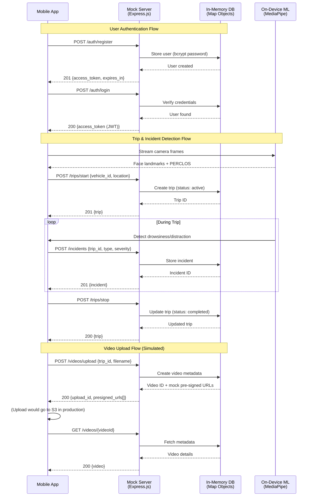

# System Architecture — SafeDrive AI (Phase 1)

```mermaid
flowchart LR
    subgraph Mobile[React Native Mobile App]
      UI[UI/UX]
      Sensors[Device Sensors\nCamera, Accelerometer, Gyro, GPS]
      OnDeviceML[On-Device ML\n(TFLite / Core ML)]
      Alerts[Alerts\nAudio / Visual / Haptic]
      UI --> Alerts
      Sensors --> OnDeviceML
      OnDeviceML --> UI
    end

    subgraph Backend[Backend (FastAPI)]
      API[REST API]
      Auth[JWT Auth]
      Svc[Services: Trips, Incidents, Videos]
      DB[(PostgreSQL)]
      Storage[(AWS S3 — Video Storage)]
      Logs[(Observability\nSentry/CloudWatch)]
      API --> Auth
      API --> Svc
      Svc --> DB
      Svc --> Storage
      API --> Logs
    end

    Mobile <--> |HTTPS / JSON| API
    Mobile --> |Chunked Upload| Storage
    Backend --> Storage

    subgraph Notifications[Notifications]
      SNS[(SES/SNS/Twilio)]
    end

    Svc --> SNS
```

## Key Decisions

- Cross-platform mobile app with React Native; on-device ML for latency and privacy
- FastAPI backend with JWT authentication; PostgreSQL as primary DB
- Video storage in S3 (pre-signed URLs) with H.264 compression
- Observability via structured logging and error tracking

## Data Flow (High Level)

### Production Architecture (Future)

1. Mobile app streams camera frames to on-device ML for face/drowsiness/distraction
2. Trip state machine gates alerts and incident logging
3. Backend manages users, trips, incidents; issues pre-signed URLs for video upload
4. Videos stored in S3; metadata in PostgreSQL
5. Notifications sent via SES/SNS/Twilio upon severe incidents

### Phase 1 Mock Server Architecture (Current)



**Key Differences from Production:**

| Component | Mock Server (Phase 1) | Production (Future) |
|-----------|------------------------|---------------------|
| **Database** | In-memory Maps (cleared on restart) | PostgreSQL with persistent storage |
| **Video Storage** | Simulated pre-signed URLs (no actual upload) | AWS S3 with chunked uploads |
| **Authentication** | JWT with bcrypt (same as production) | Same, but with token refresh |
| **Incidents** | Stored in memory | Persisted to DB + triggers notifications |
| **Delays** | Configurable via `RESPONSE_DELAY_MS` | Network latency (CDN/edge) |
| **Error Simulation** | `ENABLE_ERROR_SIMULATION=true` | Real error handling + monitoring |

**Mock Server Endpoints:**

- `POST /auth/register` → Register user, return JWT
- `POST /auth/login` → Authenticate, return JWT
- `GET /users/me` → Get current user profile
- `POST /trips/start` → Start new trip
- `POST /trips/stop` → End active trip
- `GET /trips` → List user's trips (paginated)
- `POST /incidents` → Log incident (distraction/drowsiness/crash)
- `GET /incidents/trip/{tripId}` → Get incidents for trip
- `POST /videos/upload` → Request pre-signed URL (simulated)
- `GET /videos/{videoId}` → Get video metadata
- `GET /debug/data` → View all in-memory data
- `POST /debug/reset` → Clear all data
- `GET /health` → Health check (always returns 200)

**Data Seeding:**

Mock server initializes with:
- 3 demo users (demo1@example.com, demo2@example.com, demo3@example.com)
- 10 sample trips (5 active, 5 completed)
- 25+ incidents (distraction, drowsiness, crash)
- 8 video metadata entries

See `tools/mock-server/README.md` for full API documentation and usage examples.
