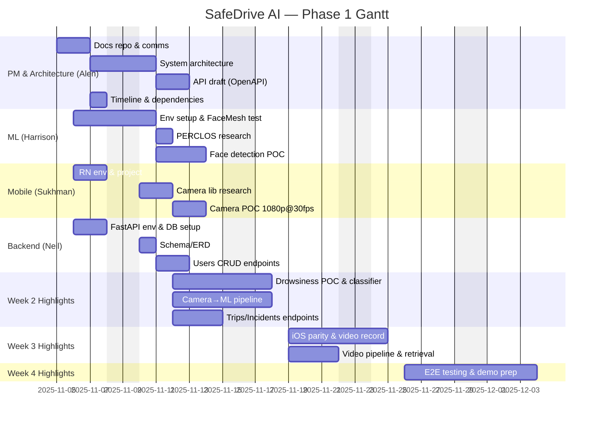

# Phase 1 Timeline (Prototype) — Nov 5 to Dec 4, 2025

## Notes

- Dependencies reflect handoffs (e.g., API draft informs backend and mobile integration)
- Weeks 2–4 are summarized at milestone level; see each team's tracker for details
